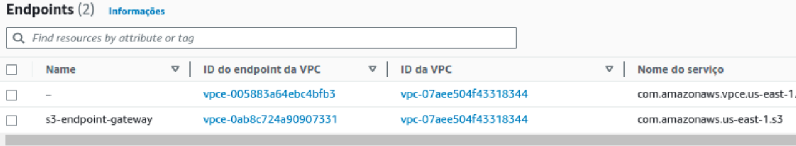

### This repository presents a solution for the fourth sprint of the MBA on Data Engineering of FIAP.
The main challenge is to develop a pipeline with a Modern Data Stack tool. The project blueprint is shown below:


### The data
The raw data comes from Rio de Janeiro's datasets from insideairbnb.com. They were stored in a S3 bucket.

### Connecting Airbyte to S3
There's no mistery here. The connection from S3 to Redshift is very straightforward since the tool already has pre-built connectors. The first load was made as shown below:


### Creating a Redshift serverless cluster

The creation of the Redshift cluster was made with the default options. However, there are some constraints regarding the inbound rules of the security groups, because no traffic is allowed. As the main goal of the project is not security, neither infrastructure or best practices of SRE, all the inbound traffic from IPV4 addresses was enabled. 


There's still a security layer, Redshift requires an username and password. S3 also needed and endpoint gateway, which was created as shown in the next image.



After that, the following scripts were executed in Redshift console with Admin powers.

 ```
-- Create database
create database analytics;

-- Create groups
create group transformer;
create group reporter;

-- create service_user
create user dbt_cloud
    password 'Dbt_cloud_123'
    in group transformer;

-- assign grants to transformer
grant create on database analytics to group transformer;

  ```

And finally, the connection between dbt and Redshift could be created.


### Transformation and modelling

A bit more about the transformation and modelling was written in the doc file. This section will be kept like this for now!

### Data analysis and visualization

The dashboard can be seen in a pdf version inside of the quicksight_dashboard folder. All of the asked questions are answered in there.

### Machine learning model for properties investors

A machine learning model was developed to predict where are the best properties of the dataset and also which amenities it must have to be successful in Airbnb. There's an ipynb in the machine_learning folder with the cleansing of the data, feature selection and some tunning.

The chosen algorithm was RidgeCV along with the Lasso Model. RidgeCV is a variant of Ridge regression that performs cross-validation to determine the optimal value of alpha. The RidgeCV class takes several parameters, including the range of alpha values to test, the number of folds for cross-validation, and the scoring metric to use. Cross-validation is a technique used to evaluate the performance of a machine learning model by splitting the data into several folds, training the model on each fold, and testing it on the remaining folds. The process is repeated several times, and the average performance is reported.

### TL;DR: A success measurement was created based on frequency and good ratings. Now the algorithm is analyzing what the most successful listings have in common.

The model predicts that properties on South and strongly East are the best ones to have good and frequent reviews, which translates in frequent rents and successful listings in the platform. Also, some amenities like self check-in, instantly booked listings (the ones that do not need host's approval) and bed linens are very important. On the other hand, price may be ignored, which makes sense, since tourists won't bother to pay fair prices while on vacation in most of the cases (that's a personal opinion). The coefficients in the Lasso Model are shown below:


And the best area to invest expecting success with property rental on Airbnb is circled in the next image.


